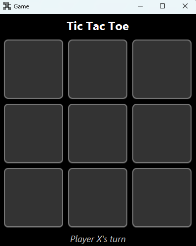

# JavaFX Tic Tac Toe Game

A modern implementation of the classic Tic Tac Toe game built with JavaFX. This project was developed as part of an Advanced Programming subject workshop.

## Author
[Milad Rezaee](https://github.com/Mil4dRezaee)  
Advanced Programming Workshop

## Screenshot


## Features

- Clean UI with dark theme
- Two-player gameplay (X and O)

## Requirements

- Java 11 or higher
- JavaFX 17.0.6
- Maven 3.11.0 or higher

## Project Structure

```
src/
├── main/
│   ├── java/
│   │   └── com/game/ticTacToe/
│   │       ├── Main.java
│   │       ├── TicTacToeController.java
│   │       └── WelcomeController.java
│   └── resources/
│       ├── com/game/ticTacToe/
│       │   ├── css/
│       │   │   └── style.css
│       │   └── fx/
│       │       ├── TicTacToe.fxml
│       │       └── Welcome.fxml
│       └── images/
│           ├── icon.png
|           └── img.png
```

## Building and Running

1. Clone the repository
2. Navigate to the project directory
3. Build the project:
```bash
mvn clean package
```
4. Run the application:
```bash
mvn javafx:run
```

## Dependencies

- org.openjfx:javafx-controls:17.0.6
- org.openjfx:javafx-fxml:17.0.6

## Contributing

This project was created as part of a university workshop. Feel free to fork and enhance it.
